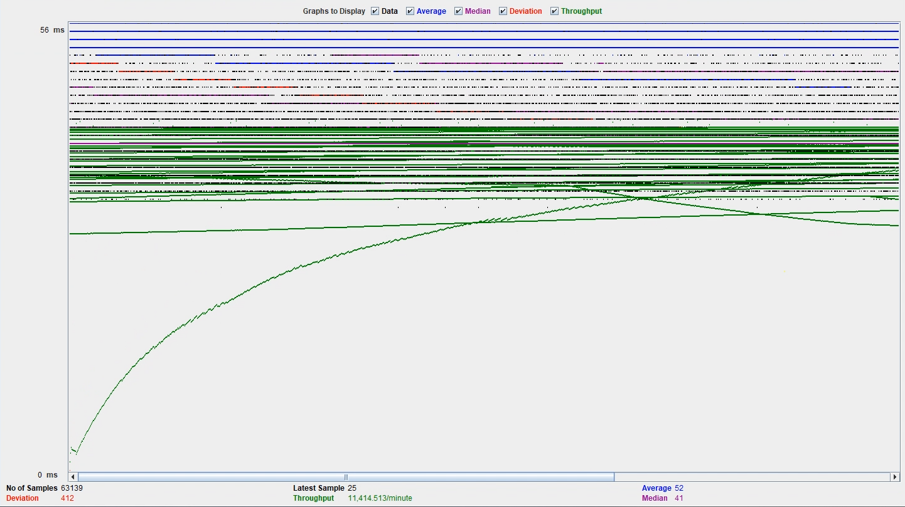

# 2023-fall-cs122b-sus

## Demonstration

- # General
    - #### Team#:sus
    
    - #### Names: Avent Chiu, Kevin Pham
    
    - #### Project Video Demo Link:
    - [Project 2](https://youtu.be/qxNiNFIsW8w)
    - [Project 3](https://youtu.be/R9QO6MY6Ruk)
    - [Project 4](https://www.youtube.com/watch?v=-3l03MVZFYc)
    - [Project 5](https://youtu.be/nITy76uG4zI)

    - #### Instruction of deployment:
        - #### TomCat
        **Username:** `admin` **Password:** `mypassword`
      - #### MySQL
        **Username:** `mytestuser` **Password:** `My6$Password` **Create Database File:** `create_table.sql` **Stored Procedures File:** `stored-procedure.sql` **Create Index File:** `create_index.sql`
      - #### Deployment
           - In both the master and slave instance: 
                - Run `mvn package` in the directory where pom.xml is located. 
                - Then run `cp ./target/*.war /var/lib/tomcat/webapps/` to copy the war file into tomcat/webapps.
           - Set up Apache2 webserver on the load balance instance by creating a load balancer proxy for the master and slave instance and make it so it is configured to enable load balancing, Connection Pooling, and sticky sessions.
    - #### Collaborations and Work Distribution:
        - Avent
            - Log Processing
            - JMeter Setup
        - Kevin
            - AWS (Load Balancer, Master/Slave, Connection Pooling)

- # Connection Pooling
    - #### Include the filename/path of all code/configuration files in GitHub of using JDBC Connection Pooling.
        - [context.xml](/WebContent/META-INF/context.xml)
        - [AutocompleteServlet.java](src/AutocompleteServlet.java)
        - [CartServlet.java](src/CartServlet.java)
        - [ConfirmationServlet.java](src/ConfirmationServlet.java)
        - [DashLoginServlet.java](src/DashLoginServlet.java)
        - [GetGenres.java](src/GetGenres.java)
        - [InsertMovieServlet.java](src/InsertMovieServlet.java)
        - [InsertStarServlet.java](src/InsertStarServlet.java)
        - [MovieListServlet.java](src/MovieListServlet.java)
        - [PaymentServlet.java](src/PaymentServlet.java)
        - [SearchServlet.java](src/SearchServlet.java)
        - [SingleMovieServlet.java](src/SingleMovieServlet.java)
        - [SingleStarServlet.java](src/SingleStarServlet.java)
    
    - #### Explain how Connection Pooling is utilized in the Fabflix code.
        - Whenever a servlet needs to access the database, it would typically create a connection to establish communication. However, to optimize performance and resource usage connection pooling is implemented.
        - In the codebase, a predefined pool of connections is configured in the context.xml file. Servlets can efficiently request connections from this pool without the overhead of establishing a new connection every time.
    
    - #### Explain how Connection Pooling works with two backend SQL.
        - Fabflix employs separate connection pools for each of the backend SQL databases, distinguishing between the Master and Slave databases.
        - Each pool is configured to maintain a maximum of 100 connections, balancing between resource utilization and handling concurrent requests efficiently.
        - To prevent resource wastage, connections that remain idle beyond a certain threshold, such as 30 connections, are automatically closed, freeing up resources for other operations.
        - Connection timeouts are configured, causing connections to fail if they wait for more than 10,000 milliseconds, thereby preventing potential bottlenecks and ensuring efficient handling of database requests.
- # Master/Slave
    - #### Include the filename/path of all code/configuration files in GitHub of routing queries to Master/Slave SQL.
        - [InsertMovieServlet.java](src/InsertMovieServlet.java)
        - [InsertStarServlet.java](src/InsertStarServlet.java)
        - [PaymentServlet.java](src/PaymentServlet.java)
    - #### How read/write requests were routed to Master/Slave SQL?
       -  The Master database can perform read and write operations through its local or master connection. However, to ensure synchronization across both databases, when initiating writes in the Slave, we exclusively utilize a connection to the Master database.

- # JMeter TS/TJ Time Logs
    - #### Instructions of how to use the `log_processing.*` script to process the JMeter logs.
        - Go to the logs directory: cd logs
        - Single instances, run `python log_processing.py PATH-TO-LOG.txt`
        - Scaled instance, run `python log_processing.py PATH-TO-MASTER-LOG.txt PATH-TO-SLAVE-LOG.txt` 

- # JMeter TS/TJ Time Measurement Report

| **Single-instance Version Test Plan**          | **Graph Results Screenshot** | **Average Query Time(ms)** | **Average Search Servlet Time(ms)** | **Average JDBC Time(ms)** | **Analysis** |
|------------------------------------------------|------------------------------|----------------------------|-------------------------------------|---------------------------|--------------|
| Case 1: HTTP/1 thread                          |    | 39                         |  2.616902937564249                  | 2.2581328927515507        | This case has the fastest time for single instance. There isn't a lot traffic for 1 thread which is why the performance is quick.           |
| Case 2: HTTP/10 threads                        |    | 47                         |  2.63429359136421                   |  2.2725699061787514       | The time is higher than 1 thread due to more traffic on the site. Serving more users, slows performance slighty. |
| Case 3: HTTPS/10 threads                       |    | 67                         |  2.662231729267565                  |  2.2675570523060613       | This has the highest query time. HTTPS requires more steps than HTTP which slows down performance.          |
| Case 4: HTTP/10 threads/No connection pooling  |    | 52                         |  2.713791472832407                  | 2.2994884875010766         | Highest Average time. Without connection pooling, there are constant opening and closing on database connections, causing poorer performance.           |

| **Scaled Version Test Plan**                   | **Graph Results Screenshot** | **Average Query Time(ms)** | **Average Search Servlet Time(ms)** | **Average JDBC Time(ms)** | **Analysis** |
|------------------------------------------------|------------------------------|----------------------------|-------------------------------------|---------------------------|--------------|
| Case 1: HTTP/1 thread                          |    | 51                         | 2.029832475989322                   | 1.7037783935791557        | Lowest ts and tj times due to few/less traffic on the site.         |
| Case 2: HTTP/10 threads                        |    | 46                         | 2.137685623406096                   | 1.8127071741314242        | Slightly higher than 1 thread due to more traffic slowing down the site. Lower query time compared to 1 thread because parallel processing from load balancing can lead to reduced processing time.         |
| Case 3: HTTP/10 threads/No connection pooling  |    | 47                         | 2.2285231862029947                  | 1.7739592525247965        | Highest average time. More traffic and no connection pooling causes slower performance, due to constant database connections opening and closing.          |

## Substring Matching Design
  - %AB%: For a query 'AB', it will return all strings the contain the pattern 'AB' in the resul
  - LIKE '%AB%'

## Examples of files with Prepared Statements
[SearchServlet.java](https://github.com/uci-jherold2-fall23-cs122b/2023-fall-cs122b-sus/blob/938daded5856e2b8412484e92649c930ff6fc60b/src/SearchServlet.java/)

[InsertMovieServlet.java](https://github.com/uci-jherold2-fall23-cs122b/2023-fall-cs122b-sus/blob/938daded5856e2b8412484e92649c930ff6fc60b/src/InsertMovieServlet.java)

[LoginServlet.java](https://github.com/uci-jherold2-fall23-cs122b/2023-fall-cs122b-sus/blob/d06403fabb2f583763517af440cd82d0cd69d6cb/src/LoginServlet.java)

[SingleStarServlet.java](https://github.com/uci-jherold2-fall23-cs122b/2023-fall-cs122b-sus/blob/d06403fabb2f583763517af440cd82d0cd69d6cb/src/SingleStarServlet.java)

[PaymentServlet.java](https://github.com/uci-jherold2-fall23-cs122b/2023-fall-cs122b-sus/blob/d06403fabb2f583763517af440cd82d0cd69d6cb/src/PaymentServlet.java)

## 2 Parsing Time Optimization Strategies
1. Parsed XML data is written to CSV files for each the "movies", "stars", and "genres" tables. LOAD DATA from SQL loads all the informations all at once instead of multiple insert queries.
2. An In-memory hash maps with database information and new information optimized our parsing time because we did not have to query against the whole database repeatedly. Instead it gave us an linear time look up for duplicates.

## Inconsistency Report from XML Parsing
### Assumptions
- all movies are already in the database
- directors, movies, and actors are correct in casts.xml
- actors with invalid birth years will have it set as null instead
- stage names are correct

[DuplicateMovies.txt](Parser/DuplicateMovies.txt)
- Movie has an id that is already in the xml file

[DuplicateStars.txt](Parser/DuplicateStars.txt)
- Star already found in database (same name and birth year OR same name and no birth year)

[NonExistentMovies.txt](Parser/NonExistentMovies.txt)
- Actors from XML do not have their movie in our database

[NonExistentStars.txt](Parser/NonExistentStars.txt)
- Actors from XML do not exist in our database

[InconsistentMovies.txt](Parser/InconsistentMovies.txt)
- Movies that do not have genres or director

## Contributions
| Kevin Pham             | Avent Chiu |
| -------------          | ------------- |
| Project Skeleton Setup |  |
| SQL Queries            | SQL Queries |
| Movie List Servlet     | Movie List Servlet |
| Single Movie Servlet   |  |
| Single Star Servlet    |  |
| Single Star Page       | Single Star Page |
|                        | Movie List Page |
|                        | Single Movie Page |
|                        | Jump Functionality |
|                        | CSS & Bootstrap Styling |
| Login                  |  |
| Search Servlet         | Search Servlet |
| Search Page            | Search Page |
| Browse Servlet         | Browse Servlet |
|       |  |
| Browse Page            | Browse Page |
| Payment Servlet        |  |
| Payment Page           |  |
| Cart Servlet           | Cart Servlet |
| Cart Page              | Cart Page |
| Confirmation Servlet   |  |
| Confirmation Page      |  |
|  | Homepage |
| Demo on AWS Instance   |  |
| Recaptcha |  |
| HTTPS |  |
| Encrypted Password Changes |  |
| Prepared Statements |  |
| Employees Login | Employees Login |
| Prepared Statements |  |
| Dashboard Setup | Dashboard |
|  | stored procedure |
| Insert Movie Servlet | Insert Movie Servlet |
| Insert Star Servlet |  Insert Star Servlet |
| xml parser setup | xml parser |
| autocomplete | autocomplete |
| android | android |

